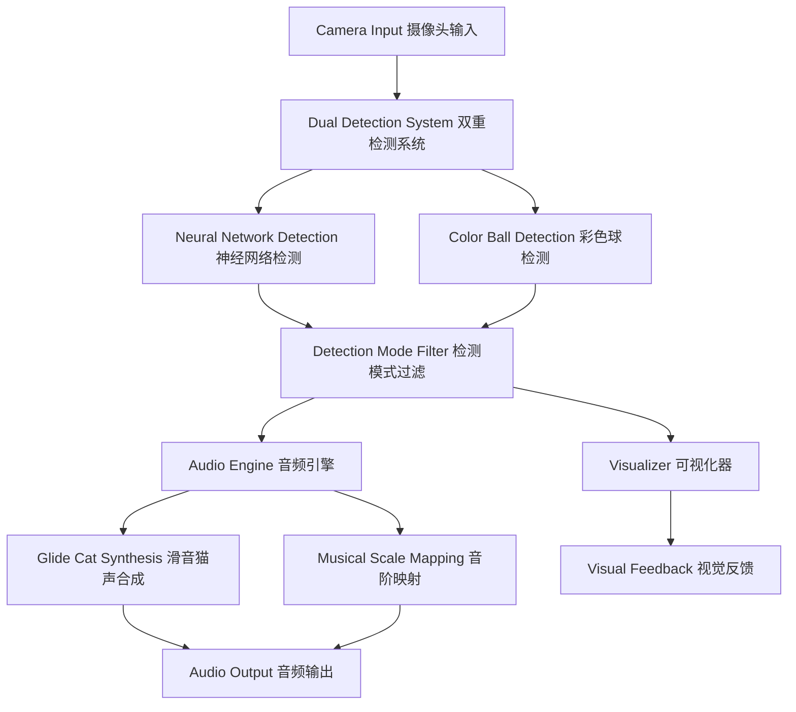

# Interactive Music Generator 交互式音乐生成器


quick start: go to line 143!!! 

## 🎵 Introduction 简介

An innovative interactive music generator powered by dual computer vision systems. The application combines neural network object detection with advanced color ball recognition to create immersive musical experiences through real-time camera interaction. Users can choose between detecting people or colored balls, with intelligent filtering to avoid interference between detection modes.

创新的交互式音乐生成器，采用双重计算机视觉系统驱动。应用结合神经网络物体检测和先进的彩色球识别技术，通过实时摄像头交互创造沉浸式音乐体验。用户可以选择检测人员或彩色小球，配备智能过滤以避免检测模式间的干扰。

## 🌟 What Makes It Special 特色亮点

- **🧠 Dual AI Systems**: Parallel neural network and color detection for versatile interaction
  **双重AI系统**: 并行神经网络和颜色检测，提供多样化交互
- **🎼 Pure Glide Cat Sound Synthesis**: Advanced audio synthesis mimicking natural cat vocalizations
  **纯滑音猫声合成**: 模拟自然猫叫声的先进音频合成技术
- **🎨 Smart Visual Distinction**: Different visual indicators for different detection systems
  **智能视觉区分**: 不同检测系统使用不同视觉指示器
- **🚫 Interference Prevention**: Intelligent filtering prevents mode conflicts
  **干扰预防**: 智能过滤防止模式冲突

## ✨ Core Features 核心功能

### 🔍 Dual Detection System 双重检测系统

#### Neural Network Detection 神经网络检测
- **Technology**: TensorFlow.js with COCO-SSD model for real-time object recognition
  **技术**: 使用COCO-SSD模型的TensorFlow.js实时物体识别
- **Objects Supported**: People, cars, animals, furniture, and 80+ everyday objects
  **支持物体**: 人员、汽车、动物、家具等80+种日常物品
- **Visual Indicator**: 🤖 Dashed bounding boxes with confidence scores
  **视觉指示**: 🤖 带置信度分数的虚线边界框

#### Color Ball Detection 彩色球检测
- **Technology**: Advanced HSV color space analysis with flood-fill algorithms
  **技术**: 基于HSV颜色空间的高级分析和泛洪填充算法
- **Supported Colors**: Red, Blue, Green, Yellow, Orange, Purple spherical objects
  **支持颜色**: 红、蓝、绿、黄、橙、紫色球形物体
- **Shape Analysis**: Circularity threshold (≥0.7) to distinguish balls from other colored objects
  **形状分析**: 圆形度阈值(≥0.7)区分球体与其他彩色物体
- **Visual Indicator**: 🎨 Solid colored bounding boxes matching detected color
  **视觉指示**: 🎨 与检测颜色匹配的实心彩色边界框

#### Smart Mode System 智能模式系统
- **People Mode** 人员模式:
  - Only neural network detection active 仅神经网络检测激活
  - Filters results to show only people 过滤结果仅显示人员
  - Optimized for human interaction 针对人机交互优化
  
- **Color Ball Mode** 彩色球模式:
  - Both detection systems active 两种检测系统均激活
  - Neural network filters OUT people to prevent hand interference 神经网络过滤人员以防止手部干扰
  - Color detection handles ball recognition 颜色检测处理球体识别

### 🎼 Advanced Audio Engine 先进音频引擎

#### Pure Glide Cat Sound Synthesis 纯滑音猫声合成
- **No Sampling**: Uses mathematical synthesis instead of audio samples for pure, controllable sounds
  **无采样**: 使用数学合成而非音频采样，产生纯净可控的声音
- **Glide Technology**: Smooth pitch transitions mimicking natural cat vocalizations
  **滑音技术**: 平滑音高转换，模拟自然猫叫声
- **Real-time Generation**: Synthesized live based on detection positions
  **实时生成**: 基于检测位置实时合成

#### Musical Intelligence 音乐智能
- **Scale Support**: Major, Minor, Pentatonic, Blues, Chromatic scales
  **音阶支持**: 大调、小调、五声音阶、蓝调、半音阶
- **Rhythm Patterns**: Basic (4/4), Techno, Jazz, Latin styles with BPM control
  **节奏模式**: 基础(4/4)、电子、爵士、拉丁风格，支持BPM控制
- **Position Mapping**: Y-coordinate → Pitch, X-coordinate → Rhythm modulation
  **位置映射**: Y坐标→音高，X坐标→节奏调制
- **Harmonic Layers**: Multiple simultaneous melodies with different timbres
  **和声层次**: 多重同时旋律，使用不同音色

### 🎨 Visual System 视觉系统

#### Detection Visualization 检测可视化
- **Neural Network Style**: 🤖 Dashed rectangles with class labels and confidence percentages
  **神经网络风格**: 🤖 带类别标签和置信度百分比的虚线矩形
- **Color Detection Style**: 🎨 Solid colored rectangles matching detected ball color
  **颜色检测风格**: 🎨 与检测球颜色匹配的实心彩色矩形
- **Real-time Updates**: 60 FPS smooth tracking with interpolated movement
  **实时更新**: 60 FPS平滑追踪，支持插值移动

#### Musical Feedback 音乐反馈
- **Particle Effects**: Visual particles synchronized with generated notes
  **粒子效果**: 与生成音符同步的视觉粒子
- **Color Coding**: Different colors for different musical elements
  **颜色编码**: 不同音乐元素使用不同颜色
- **Audio Visualization**: Real-time frequency analysis display
  **音频可视化**: 实时频率分析显示

## 🛠 Technology Stack 技术栈

| Component | Technology | Purpose | Version |
|-----------|------------|---------|---------|
| **🧠 Neural Network** | TensorFlow.js + COCO-SSD | Real-time object detection | ^4.10.0 |
| **🎨 Color Detection** | Custom HSV Analysis | Color ball recognition | Custom |
| **🎵 Audio Engine** | Tone.js | Web Audio synthesis | ^14.7.77 |
| **🖥️ Frontend** | Vanilla JavaScript + Vite | Fast development & bundling | ^4.4.9 |
| **📷 Camera Access** | MediaDevices API | Real-time video stream | Native |
| **🎨 Visualization** | Canvas 2D API | Real-time graphics rendering | Native |
| **🔧 Build Tool** | Vite | Fast HMR & bundling | ^4.4.9 |

## 🏗️ Architecture Overview 架构概览

```
Interactive Music Generator 交互式音乐生成器
├── 📷 Camera Input 摄像头输入
│   └── MediaDevices API 媒体设备API
├── 🔍 Dual Detection System 双重检测系统
│   ├── 🧠 Neural Network Detection 神经网络检测
│   │   ├── TensorFlow.js (AI Engine)
│   │   └── COCO-SSD Model (Object Recognition)
│   └── 🎨 Color Detection 颜色检测
│       ├── HSV Color Space Analysis HSV颜色空间分析
│       ├── Flood Fill Algorithm 泛洪填充算法
│       └── Shape Circularity Analysis 形状圆形度分析
├── 🎼 Audio Processing 音频处理
│   ├── 🐱 Cat Sound Synthesis 猫声合成
│   │   ├── Pure Glide Generation 纯滑音生成
│   │   └── Mathematical Modeling 数学建模
│   ├── 🎵 Musical Engine 音乐引擎
│   │   ├── Scale Management 音阶管理
│   │   ├── Rhythm Patterns 节奏模式
│   │   └── Real-time Audio Synthesis 实时音频合成
│   └── 🔊 Tone.js (Web Audio API)
├── 🎨 Visualization 可视化
│   ├── Detection Overlays 检测覆盖层
│   ├── Musical Particle Effects 音乐粒子效果
│   └── Real-time Canvas Rendering 实时Canvas渲染
└── 🎛️ User Interface 用户界面
    ├── Detection Mode Selector 检测模式选择器
    ├── Audio Controls 音频控制
    └── Visual Settings 视觉设置
```

## 🚀 Getting Started 快速开始

### Prerequisites 前置要求

- **Node.js**: Version 16.0 or higher 版本16.0或更高
- **Modern Browser**: Chrome 88+, Firefox 85+, Safari 14+ 现代浏览器
- **Camera**: Built-in or external webcam 内置或外置摄像头
- **Microphone Permissions**: For audio output 音频输出权限

### Installation 安装

1. **Clone the repository 克隆仓库**
   ```bash
   git clone https://github.com/your-username/interactive-music-generator.git
   cd interactive-music-generator
   ```

2. **Install dependencies 安装依赖**
   ```bash
   npm install
   ```

3. **Start development server 启动开发服务器**
   ```bash
   npm run dev
   ```

4. **Open in browser 在浏览器中打开**
   ```
   http://localhost:5173
   ```

## 📖 User Guide 使用指南

### Initial Setup 初始设置

1. **Grant Camera Permission 授予摄像头权限**
   - Allow browser access to your camera when prompted
   - 在提示时允许浏览器访问您的摄像头

2. **Audio Setup 音频设置**
   - Ensure speakers or headphones are connected
   - 确保扬声器或耳机已连接
   - Browser will request audio permissions automatically
   - 浏览器将自动请求音频权限

### Detection Modes 检测模式

#### 👥 People Mode 人员模式

**When to use**: Interactive performances, dance, fitness, or general human movement interaction
**使用场景**: 互动表演、舞蹈、健身或一般人体运动交互

**Setup 设置**:
- Select "Detect People" from the detection mode dropdown
- 从检测模式下拉菜单选择"检测人员"
- Stand within camera view (2-8 feet recommended)
- 站在摄像头视野内（推荐2-8英尺距离）

**How it works 工作原理**:
- 🤖 Neural network detects human figures with dashed boxes
- 🤖 神经网络用虚线框检测人体轮廓
- Y-position controls musical pitch (higher = higher notes)
- Y位置控制音乐音高（越高音符越高）
- X-position influences rhythm patterns
- X位置影响节奏模式
- Multiple people create harmony layers
- 多人创建和声层次

#### 🎨 Color Ball Mode 彩色球模式

**When to use**: Precise control, teaching, demonstrations, or avoiding hand interference
**使用场景**: 精确控制、教学、演示或避免手部干扰

**Setup 设置**:
- Select "Detect Color Balls" from the detection mode dropdown
- 从检测模式下拉菜单选择"检测彩色球"
- Use colored balls: Red, Blue, Green, Yellow, Orange, Purple
- 使用彩色球：红、蓝、绿、黄、橙、紫
- Hold balls in camera view while avoiding hand detection
- 在摄像头视野中举起球，同时避免手部被检测

**Supported Colors 支持的颜色**:
- 🔴 **Red** 红色: Bright red balls work best
- 🔵 **Blue** 蓝色: Deep blue for optimal detection
- 🟢 **Green** 绿色: Bright green recommended
- 🟡 **Yellow** 黄色: Vibrant yellow balls
- 🟠 **Orange** 橙色: Bright orange objects
- 🟣 **Purple** 紫色: Deep purple balls

**How it works 工作原理**:
- 🎨 Color detection shows solid colored boxes matching ball color
- 🎨 颜色检测显示与球颜色匹配的实心彩色框
- Advanced HSV analysis identifies ball shapes
- 高级HSV分析识别球形
- Neural network filters out human hands automatically
- 神经网络自动过滤人手
- Each color can trigger different musical elements
- 每种颜色可触发不同音乐元素

### Musical Controls 音乐控制

#### Scale Selection 音阶选择
- **Major** 大调: Happy, bright melodies
- **Minor** 小调: Sad, melancholic tones
- **Pentatonic** 五声音阶: Asian-inspired, flowing sounds
- **Blues** 蓝调: Soulful, expressive notes
- **Chromatic** 半音阶: All 12 notes, experimental

#### Rhythm Patterns 节奏模式
- **Basic** 基础: Simple 4/4 time signature
- **Techno** 电子: Electronic dance beats
- **Jazz** 爵士: Syncopated, swing rhythms
- **Latin** 拉丁: Caribbean-inspired patterns

#### Audio Settings 音频设置
- **BPM Control**: Adjust tempo (60-180 BPM)
  **BPM控制**: 调整节拍速度（60-180 BPM）
- **Volume**: Master volume control
  **音量**: 主音量控制
- **Cat Synthesis**: Pure glide-based cat sound generation
  **猫声合成**: 基于纯滑音的猫声生成

### Advanced Features 高级功能

#### Visual Customization 视觉自定义
- **Detection Overlays**: Toggle bounding boxes on/off
  **检测覆盖**: 开关边界框显示
- **Particle Effects**: Musical note visualization
  **粒子效果**: 音符可视化
- **Color Themes**: Different visual styles
  **颜色主题**: 不同视觉风格

#### Performance Optimization 性能优化
- **Detection Rate**: Adjust frames per second
  **检测率**: 调整每秒帧数
- **Model Quality**: Balance accuracy vs speed
  **模型质量**: 平衡准确度与速度
- **Audio Buffer**: Optimize for low latency
  **音频缓冲**: 优化低延迟

## 💡 Tips for Best Experience 最佳体验技巧

### Lighting Conditions 光照条件
- **Bright, even lighting** works best for detection
  **明亮均匀的光照**最适合检测
- Avoid **backlighting** (windows behind you)
  避免**背光**（身后有窗户）
- **LED lights** provide consistent color temperature
  **LED灯**提供一致的色温

### Camera Positioning 摄像头定位
- Position camera at **chest height** for people mode
  人员模式下将摄像头定位在**胸部高度**
- Keep **2-8 feet distance** from camera
  与摄像头保持**2-8英尺距离**
- Ensure **full body visibility** for best tracking
  确保**全身可见**以获得最佳追踪

### Color Ball Usage 彩色球使用
- Use **matte finish** balls to avoid glare
  使用**哑光**球避免眩光
- **Tennis ball size** works optimally
  **网球大小**效果最佳
- Hold balls with **fingertips** to minimize hand detection
  用**指尖**握球以减少手部检测

## 🛠️ Development 开发指南

### Project Structure 项目结构

```
src/
├── main.js                 # 主应用入口 Main application entry
├── models/                 # 检测模型 Detection models
│   ├── visionModel.js     # 神经网络检测 Neural network detection
│   └── colorDetection.js  # 颜色检测 Color detection
├── audio/                  # 音频系统 Audio system
│   ├── audioEngine.js     # 主音频引擎 Main audio engine
│   ├── instruments/       # 乐器合成 Instrument synthesis
│   ├── effects/           # 音频效果 Audio effects
│   └── sequencer/         # 音序器 Sequencer
├── components/            # UI组件 UI components
│   ├── controls.js        # 控制面板 Control panel
│   └── visualizer.js      # 可视化 Visualization
└── utils/                 # 工具函数 Utility functions
    └── helpers.js         # 辅助函数 Helper functions
```

### Key Components 关键组件

#### VisionModel (visionModel.js)
- **Neural Network Integration**: TensorFlow.js object detection
  **神经网络集成**: TensorFlow.js物体检测
- **Filtering System**: Configurable object type filtering
  **过滤系统**: 可配置的物体类型过滤
- **Performance Optimization**: Frame rate and model size optimization
  **性能优化**: 帧率和模型大小优化

#### ColorDetection (colorDetection.js)
- **HSV Analysis**: Advanced color space conversion and analysis
  **HSV分析**: 高级颜色空间转换和分析
- **Shape Recognition**: Circularity detection for ball identification
  **形状识别**: 用于球体识别的圆形度检测
- **Flood Fill Algorithm**: Accurate color region detection
  **泛洪填充算法**: 准确的颜色区域检测

#### AudioEngine (audioEngine.js)
- **Pure Synthesis**: Mathematical cat sound generation
  **纯合成**: 数学猫声生成
- **Scale Management**: Musical scale and harmony handling
  **音阶管理**: 音乐音阶和和声处理
- **Real-time Processing**: Low-latency audio generation
  **实时处理**: 低延迟音频生成

### Contributing 贡献代码

1. **Fork the repository 克隆仓库**
2. **Create feature branch 创建功能分支**
   ```bash
   git checkout -b feature/amazing-feature
   ```
3. **Commit changes 提交更改**
   ```bash
   git commit -m 'Add amazing feature'
   ```
4. **Push to branch 推送到分支**
   ```bash
   git push origin feature/amazing-feature
   ```
5. **Open Pull Request 开启拉取请求**

### Development Areas 开发领域

- **🔍 Detection Algorithms**: Improve accuracy and add new object types
  **检测算法**: 提高准确性并添加新物体类型
- **🎵 Audio Features**: New synthesis methods and musical styles
  **音频功能**: 新合成方法和音乐风格
- **🎨 Visual Effects**: Enhanced particle systems and UI design
  **视觉效果**: 增强粒子系统和UI设计
- **📱 User Interface**: Mobile optimization and accessibility
  **用户界面**: 移动端优化和无障碍性
- **📚 Documentation**: Tutorials, examples, and API documentation
  **文档**: 教程、示例和API文档
- **Interaction**: Move in front of the camera to generate music
  **交互**: 在摄像头前移动生成音乐
- **Position Control**: 
  - Vertical position (Y) controls pitch (higher = higher pitch)
  - Horizontal position (X) influences rhythm patterns
  
  **位置控制**:
  - 垂直位置(Y)控制音高(越高音高越高)
  - 水平位置(X)影响节奏模式

### Color Ball Mode 彩色球模式

- **Setup**: Select "Detect Color Balls" from the detection mode dropdown
  **设置**: 从检测模式下拉菜单选择"检测彩色球"
- **Supported Colors**: Red, Blue, Green, Yellow, Orange, Purple
  **支持颜色**: 红、蓝、绿、黄、橙、紫
- **Interaction**: Hold colored balls or spherical objects in front of camera
  **交互**: 在摄像头前持拿彩色球或球形物体
- **Anti-interference**: Human hands are automatically filtered out
  **抗干扰**: 自动过滤人手

### Control Panel 控制面板

- **Musical Scale**: Choose from Major, Minor, Pentatonic, or Blues scales
  **音阶**: 选择大调、小调、五声音阶或蓝调音阶
- **Rhythm Pattern**: Select Basic, Techno, Jazz, or Latin rhythm styles  
  **节奏模式**: 选择基础、电子、爵士或拉丁节奏风格
- **Volume Control**: Adjust overall system volume
  **音量控制**: 调节系统整体音量
- **Visual Effects**: Toggle music visualization on/off
  **视觉效果**: 开关音乐可视化

## 🏗 Architecture 架构设计

### System Overview 系统概述



### Project Structure 项目结构

```
interactive-music-generator/
├── 📁 public/                    # Static assets 静态资源
│   ├── 📁 background/            # Background images 背景图片
│   ├── 📁 cat/                   # Cat images for particles 猫咪图片粒子
│   └── 📁 miao/                  # Cat sound samples 猫叫音频样本
│
├── 📁 src/                       # Source code 源代码
│   ├── 📄 main.js               # Application entry point 应用程序入口
│   │
│   ├── 📁 components/            # UI Components UI组件
│   │   ├── 📄 controls.js       # Detection mode & audio controls 检测模式和音频控制
│   │   └── 📄 visualizer.js     # Real-time visual feedback 实时视觉反馈
│   │
│   ├── 📁 models/               # Detection Models 检测模型
│   │   ├── 📄 visionModel.js    # TensorFlow.js neural network 神经网络
│   │   └── 📄 colorDetection.js # HSV color ball detection HSV彩色球检测
│   │
│   ├── 📁 audio/                # Audio Processing 音频处理
│   │   ├── 📄 audioEngine.js    # Core audio synthesis 核心音频合成
│   │   ├── 📁 effects/          # Audio effects chain 音频效果链
│   │   ├── 📁 instruments/      # Synthesizer instruments 合成器乐器
│   │   └── 📁 sequencer/        # Rhythm and timing 节奏和时序
│   │
│   └── 📁 utils/                # Utility functions 工具函数
│       └── 📄 helpers.js        # Common utilities 通用工具
│
├── 📄 index.html                # Main HTML file 主HTML文件
├── 📄 package.json              # Dependencies 项目依赖
├── 📄 vite.config.js            # Build configuration 构建配置
└── 📄 README.md                 # Documentation 项目文档
```

### Core Components 核心组件

#### 🧠 Dual Detection System 双重检测系统

**Neural Network Detection (visionModel.js)**
- Uses TensorFlow.js COCO-SSD model for object recognition
- Supports detection of people and common objects
- Configurable object filtering and confidence thresholds

**神经网络检测 (visionModel.js)**
- 使用TensorFlow.js COCO-SSD模型进行物体识别
- 支持人员和常见物体检测
- 可配置物体过滤和置信度阈值

**Color Ball Detection (colorDetection.js)**
- Custom HSV-based color analysis algorithm
- Circularity detection for identifying ball shapes
- Flood-fill connected component analysis
- Support for 6 distinct colors with customizable ranges

**彩色球检测 (colorDetection.js)**
- 基于HSV的自定义颜色分析算法
- 圆形度检测识别球形
- 洪水填充连通分量分析
- 支持6种不同颜色，可自定义范围

#### 🎵 Audio Engine 音频引擎

**Glide Cat Synthesis (audioEngine.js)**
- Pure glide synthesis for expressive cat sound effects
- Real-time parameter adjustment based on object position
- Smooth transitions between notes with configurable glide time
- Integration with Tone.js for high-quality audio output

**滑音猫声合成 (audioEngine.js)**
- 纯滑音合成产生富有表现力的猫声效果
- 基于物体位置的实时参数调整
- 可配置滑音时间的平滑音符过渡
- 与Tone.js集成实现高质量音频输出

#### 🎨 Visual System 视觉系统

**Real-time Visualization (visualizer.js)**
- Dual rendering modes for different detection sources
- Animated bounding boxes with source identification
- Musical particle effects synchronized with audio
- Performance-optimized canvas rendering

**实时可视化 (visualizer.js)**
- 不同检测源的双重渲染模式
- 带源识别的动画边界框
- 与音频同步的音乐粒子效果
- 性能优化的画布渲染

## 🔧 Development 开发指南

### Building 构建

```bash
# Development build 开发构建
npm run dev

# Production build 生产构建
npm run build

# Preview production build 预览生产构建
npm run preview
```

### Debugging 调试

1. **Enable Debug Mode 启用调试模式**
   - Open browser developer tools
   - Check console for detection and audio logs
   
   - 打开浏览器开发者工具
   - 检查控制台的检测和音频日志

2. **Performance Monitoring 性能监控**
   - Monitor frame rate in the visualizer
   - Check detection frequency and timing
   
   - 监控可视化器中的帧率
   - 检查检测频率和时序

### Customization 自定义

#### Adding New Colors 添加新颜色

Edit `src/models/colorDetection.js`:
编辑 `src/models/colorDetection.js`:

```javascript
this.colorRanges.newColor = {
    lower: [hue_min, sat_min, val_min],
    upper: [hue_max, sat_max, val_max],
    name: 'new color ball'
};
```

#### Modifying Audio Parameters 修改音频参数

Edit `src/audio/audioEngine.js`:
编辑 `src/audio/audioEngine.js`:

```javascript
// Adjust glide timing 调整滑音时序
this.defaultGlideTime = 0.3; // seconds 秒

// Modify pitch range 修改音高范围
this.pitchRange = { min: 200, max: 800 }; // Hz
```

## 🤝 Contributing 贡献指南

We welcome contributions from developers, musicians, and computer vision enthusiasts! 
我们欢迎来自开发者、音乐家和计算机视觉爱好者的贡献！

### How to Contribute 如何贡献

1. **Fork the Repository 复刻仓库**
   ```bash
   git fork https://github.com/yourusername/interactive-music-generator.git
   ```

2. **Create Feature Branch 创建功能分支**
   ```bash
   git checkout -b feature/amazing-new-feature
   ```

3. **Make Changes 进行修改**
   - Add new detection algorithms
   - Improve audio synthesis
   - Enhance visual effects
   - Fix bugs and optimize performance
   
   - 添加新的检测算法
   - 改进音频合成
   - 增强视觉效果
   - 修复错误和优化性能

4. **Test Your Changes 测试修改**
   ```bash
   npm run dev
   # Test with different cameras and lighting conditions
   # 使用不同摄像头和光照条件测试
   ```

5. **Submit Pull Request 提交拉取请求**
   ```bash
   git push origin feature/amazing-new-feature
   # Then create PR on GitHub 然后在GitHub创建PR
   ```

### Contribution Areas 贡献领域

- **🔍 Computer Vision**: Improve detection accuracy, add new object types
  **计算机视觉**: 提高检测精度，添加新物体类型
- **🎵 Audio Synthesis**: Create new instruments, improve sound quality
  **音频合成**: 创建新乐器，改进音质
- **🎨 Visualization**: Add new visual effects, improve performance
  **可视化**: 添加新视觉效果，提高性能
- **📱 User Interface**: Enhance controls, add new features
  **用户界面**: 增强控制，添加新功能
- **📚 Documentation**: Improve guides, add tutorials
  **文档**: 改进指南，添加教程

## 🐛 Troubleshooting 故障排除

### Common Issues 常见问题

#### Camera Not Working 摄像头无法工作
- **Check browser permissions 检查浏览器权限**
- **Try different browsers 尝试不同浏览器**
- **Ensure camera is not used by other applications 确保摄像头未被其他应用占用**

#### Audio Not Playing 音频无法播放
- **Check browser audio permissions 检查浏览器音频权限**
- **Verify audio output device 验证音频输出设备**
- **Try refreshing the page 尝试刷新页面**

#### Detection Not Working 检测无法工作
- **Ensure good lighting conditions 确保良好光照条件**
- **Check object positioning in camera view 检查物体在摄像头视野中的位置**
- **Try different detection modes 尝试不同检测模式**

#### Performance Issues 性能问题
- **Close other browser tabs 关闭其他浏览器标签**
- **Use Chrome for better performance 使用Chrome以获得更好性能**
- **Lower video resolution if needed 如需要可降低视频分辨率**

### Debug Mode 调试模式

Enable debug logging by opening browser console:
通过打开浏览器控制台启用调试日志：

```javascript
// Enable detection logging 启用检测日志
window.DEBUG_DETECTION = true;

// Enable audio logging 启用音频日志
window.DEBUG_AUDIO = true;
```

## 📊 Performance 性能指标

### Recommended Specifications 推荐规格

| Component | Minimum | Recommended |
|-----------|---------|-------------|
| **CPU** | Dual-core 2GHz | Quad-core 3GHz+ |
| **RAM** | 4GB | 8GB+ |
| **GPU** | Integrated | Dedicated |
| **Camera** | 720p | 1080p |
| **Browser** | Chrome 90+ | Chrome Latest |

| 组件 | 最低要求 | 推荐配置 |
|------|----------|----------|
| **CPU** | 双核2GHz | 四核3GHz+ |
| **内存** | 4GB | 8GB+ |
| **显卡** | 集成显卡 | 独立显卡 |
| **摄像头** | 720p | 1080p |
| **浏览器** | Chrome 90+ | Chrome最新版 |

### Performance Benchmarks 性能基准

- **Detection Rate**: 15-30 FPS (depending on hardware)
  **检测速率**: 15-30帧/秒 (取决于硬件)
- **Audio Latency**: <50ms response time
  **音频延迟**: <50毫秒响应时间
- **Memory Usage**: ~200MB typical
  **内存使用**: 典型约200MB

## 📄 License 许可证

MIT License - Feel free to use this project for personal and commercial purposes.
MIT许可证 - 欢迎将此项目用于个人和商业用途。

## 🙏 Acknowledgments 致谢

### Special Thanks 特别感谢

- **TensorFlow.js Team** - For powerful browser-based machine learning
  **TensorFlow.js团队** - 提供强大的浏览器机器学习能力
- **Tone.js Community** - For exceptional web audio framework
  **Tone.js社区** - 提供卓越的网页音频框架
- **Computer Vision Researchers** - For advancing the field of real-time object detection
  **计算机视觉研究者** - 推进实时物体检测领域的发展
- **Open Source Contributors** - For making this project possible
  **开源贡献者** - 使这个项目成为可能

### Inspiration 灵感来源

This project draws inspiration from:
这个项目的灵感来源于：

- Interactive art installations combining movement and sound
  结合运动和声音的互动艺术装置
- Musical instruments that respond to gesture and motion
  响应手势和动作的乐器
- Computer vision applications in creative technology
  创意技术中的计算机视觉应用

---

## 🔗 Links 相关链接

- **Demo Video**: [Coming Soon] **演示视频**: [即将推出]
- **Live Demo**: [GitHub Pages] **在线演示**: [GitHub Pages]
- **Issues**: [Report Bugs] **问题**: [报告错误]
- **Discussions**: [Community Forum] **讨论**: [社区论坛]

---

<div align="center">

**Made with ❤️ by Computer Vision Music Enthusiasts**  
**由计算机视觉音乐爱好者用❤️制作**

[⭐ Star this project if you found it helpful! ⭐]  
[⭐ 如果这个项目对您有帮助，请给个星！⭐]

</div>